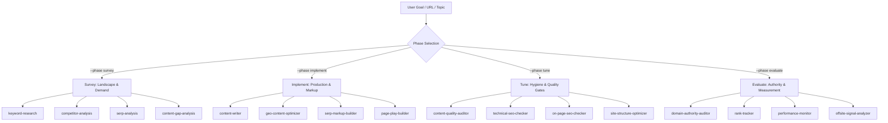

# SEO/GEO Master Orchestrator

The unified **SEO/GEO Marketing** system built on the **SITE loop** (Survey → Implement → Tune → Evaluate). It bridges classic search engine ranking (Google/Bing) and Generative Engine Optimization (getting cited in ChatGPT, Perplexity, Google AI Overviews, Gemini, Claude, and Copilot).

All work across this system adheres to two auditor-class quality gates:
1. **[CORE-EEAT](../../references/core-eeat-benchmark.md)** for content quality & publish readiness (SHIP / FIX / BLOCK).
2. **[CITE](../../references/cite-domain-rating.md)** for domain citation trust & authority (TRUSTED / CAUTIOUS / UNTRUSTED).

--------------------------------------------------------------------------------

## The SITE Loop & Phase Routing

When a goal is given, either infer the phase or honor the `--phase` flag:

```text
/seo-geo <goal, topic, or URL> [--phase survey|implement|tune|evaluate] [flags]
```



### 1. Phase 1: Survey (`--phase survey`)
*Understand demand, intent, and competitor positions before writing code or content.*
- **[keyword-research](../keyword-research/SKILL.md)**: Seed discovery, intent tagging, long-tail expansion, striking distance (pos 5–20), volume/difficulty opportunity scoring, and topic clusters.
- **[competitor-analysis](../competitor-analysis/SKILL.md)**: Domain comparison battlecards, keyword overlap, content footprint, backlink gap, and AI citation visibility.
- **[serp-analysis](../serp-analysis/SKILL.md)**: Live SERP feature extraction, featured snippets, People Also Ask (PAA), video packs, and intent pattern matching.
- **[content-gap-analysis](../content-gap-analysis/SKILL.md)**: Missing topic clusters and coverage holes compared to top-ranking domains.

### 2. Phase 2: Implement (`--phase implement`)
*Build high-ranking, AI-quotable assets and technical structured data.*
- **[content-writer](../content-writer/SKILL.md)**: High-ranking articles, landing pages, refresh of decaying content, outline/brief to publication.
- **[geo-content-optimizer](../geo-content-optimizer/SKILL.md)**: Generative Engine Optimization (GEO). Crafts quotable entity definition sentences, data tables, factual density, and clear question-answer blocks for LLMs.
- **[serp-markup-builder](../serp-markup-builder/SKILL.md)**: CTR-optimized `<title>`, `<meta description>`, Open Graph / Twitter Cards, and valid Schema.org JSON-LD (Article, FAQPage, Organization, Product, Course).
- **[page-play-builder](../page-play-builder/SKILL.md)**: Template plays across 4 archetypes: Programmatic SEO, Comparison ("X vs Y"), Local / GBP, and Parasite SEO.

### 3. Phase 3: Tune (`--phase tune`)
*Enforce pre-publish quality, Core Web Vitals, crawlability, and on-page signals.*
- **[content-quality-auditor](../content-quality-auditor/SKILL.md)**: **The 80-item CORE-EEAT Gate**. Audits Credibility, Originality, Relevance, Experience, Expertise, Authoritativeness, Trustworthiness, and Structure. Enforces veto items (`T04`, `C01`, `R10`). Verdict: `SHIP`, `FIX`, or `BLOCK`.
- **[technical-seo-checker](../technical-seo-checker/SKILL.md)**: Crawlability, robots.txt, sitemaps, canonicals, redirect chains, Core Web Vitals (LCP, INP, CLS), and LLM crawler permissions (GPTBot, ClaudeBot, PerplexityBot).
- **[on-page-seo-checker](../on-page-seo-checker/SKILL.md)**: Page-level heading hierarchies (single H1, logical H2/H3), keyword density, image alt text, word count, and internal links.
- **[site-structure-optimizer](../site-structure-optimizer/SKILL.md)**: Silo architectures, pillar/cluster internal linking, anchor text hygiene, orphan page identification.

### 4. Phase 4: Evaluate (`--phase evaluate`)
*Measure ranking trajectory, domain authority, and protect search visibility.*
- **[domain-authority-auditor](../domain-authority-auditor/SKILL.md)**: **The 40-item CITE Domain Gate**. Audits Citation Quality, Integrity, Technical Authority, and Entity Recognition. Enforces veto items (`T03`, `T05`, `T09`). Verdict: `TRUSTED`, `CAUTIOUS`, or `UNTRUSTED`.
- **[rank-tracker](../rank-tracker/SKILL.md)**: Track keyword ranking positions, detect distribution shifts, and investigate ranking drops.
- **[performance-monitor](../performance-monitor/SKILL.md)**: Multi-metric SEO/GEO reports across organic clicks, impressions, CTR, AI referrals, and anomaly threshold alerts.
- **[offsite-signal-analyzer](../offsite-signal-analyzer/SKILL.md)**: Backlink profile health, toxic link detection, referring domain velocity, and AI assistant referral traffic.

--------------------------------------------------------------------------------

## Python Local Connectors (`.agents/scripts/connectors/`)

All connectors run with Python 3 standard library (no pip dependencies required):

- **Extract on-page SEO signals from URL or file**:
  ```bash
  python3 .agents/scripts/connectors/onpage.py <url>
  cat page.html | python3 .agents/scripts/connectors/onpage.py --html -
  ```
- **Evaluate robots.txt and verify AI crawler access**:
  ```bash
  python3 .agents/scripts/connectors/robots.py <domain> --check-ai-bots
  ```
- **Inspect sitemap.xml and find URLs**:
  ```bash
  python3 .agents/scripts/connectors/sitemap.py <sitemap_url_or_domain> --limit 100
  ```
- **Validate JSON-LD structured data locally**:
  ```bash
  python3 .agents/scripts/connectors/schema_lint.py <url> --pretty
  ```
- **Harvest Google Autocomplete keyword expansions**:
  ```bash
  python3 .agents/scripts/connectors/suggest.py "<seed-keyword>" --expand
  ```
- **Core Web Vitals & PageSpeed Insights**:
  ```bash
  python3 .agents/scripts/connectors/psi.py <url> --strategy mobile
  ```
- **Wikipedia attention demand proxy**:
  ```bash
  python3 .agents/scripts/connectors/pageviews.py "<Topic>" --months 12
  ```

--------------------------------------------------------------------------------

## Evidence Standard

Every claim or metric reported by any SEO skill MUST be labeled with its evidence type:
1. **Measured**: Sourced directly from tool output, GSC/GA4 export, or connector execution.
2. **Calculated**: Derived mathematically from measured data (e.g. CTR, bounce rates, weighted scores).
3. **Estimated**: Based on industry benchmarks or heuristics.
4. **Proxy**: A substitute signal (e.g. Wikipedia pageviews as an interest proxy).
5. **Unknown**: Data is not available. **Never invent or assume unmeasured metrics.**

--------------------------------------------------------------------------------

## Quality Gates Summary

| Gate | Framework | Evaluates | Veto Checks | Verdicts |
|---|---|---|---|---|
| **Content Gate** | [CORE-EEAT](../../references/core-eeat-benchmark.md) | 80 items across 8 dims (Credibility, Originality, Relevance, Experience, Expertise, Authoritativeness, Trustworthiness, Structure) | `T04` (Factual fabrication), `C01` (Deceptive claims), `R10` (Keyword stuffing / manipulation) | `SHIP` (Ready to publish)<br>`FIX` (Address non-fatal issues)<br>`BLOCK` (Veto violation) |
| **Domain Gate** | [CITE](../../references/cite-domain-rating.md) | 40 items across 4 dims (Citation quality, Integrity, Technical authority, Entity recognition) | `T03` (Malware/spam penalty), `T05` (Cloaking), `T09` (Security breach/expired SSL) | `TRUSTED` (Passes gate)<br>`CAUTIOUS` (Gaps identified)<br>`UNTRUSTED` (Veto capped) |

> **Veto Rule**: A single verified veto caps the maximum score at `min(raw, 59)`. Two or more verified vetoes trigger an immediate `BLOCK`.
